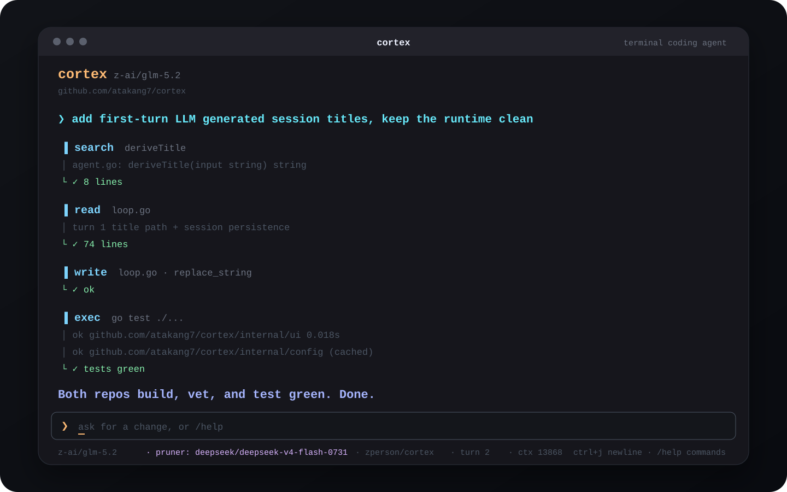
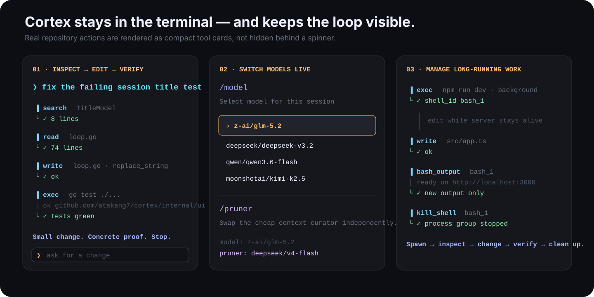

<div align="center">

# cortex

### A terminal coding agent that works the repository, proves the change, and gets out of your way.

Built in Go · powered by [Axon](https://github.com/atakang7/axon)

[](https://github.com/atakang7/cortex/releases/latest)
[](https://go.dev/)
[](https://github.com/atakang7/axon)
[](LICENSE)

**Search → read → edit → verify.**

</div>

<p align="center">
  
</p>

Cortex is a coding agent for people who already live in the terminal. It does not hide the repository behind a chat UI: you watch it search, inspect files, edit, run tests, manage processes, and finish with concrete verification.

```sh
go install github.com/atakang7/cortex/cmd/cortex@latest
```

**Want the 60-second setup? → [Lightning quickstart](docs/src/content/docs/index.mdx)**

---

## The experience

<p align="center">
  
</p>

Cortex is intentionally opinionated about the loop:

<table>
<tr><td><b>Search before guessing</b></td><td>Find the code before loading or editing it.</td></tr>
<tr><td><b>Read before writing</b></td><td>No blind file edits.</td></tr>
<tr><td><b>Small change, then proof</b></td><td>Run the test, build, linter, server, or command that closes the loop.</td></tr>
<tr><td><b>Act, don't narrate</b></td><td>Do the work first; summarize when there is something real to report.</td></tr>
<tr><td><b>Stop when done</b></td><td>No surprise refactors or invented scope.</td></tr>
</table>

That behavior comes from Cortex's real default coding prompt in [`internal/config/prompt.go`](internal/config/prompt.go), not from README marketing.

---

## What you see is what it is doing

Cortex renders Axon's runtime events directly into a small live terminal area while completed output stays in normal terminal scrollback.

```text
❯ fix the failing session test

  ▐ search  TitleModel
  └ ✓ 8 lines

  ▐ read  loop.go
  └ ✓ 74 lines

  ▐ write  loop.go · replace_string
  └ ✓ ok

  ▐ exec  go test ./...
  │ ok   github.com/atakang7/cortex/internal/ui
  └ ✓ tests green

  Both repos build, vet, and test green. Done.
```

The transcript remains searchable, selectable, copyable, and visible after Cortex exits. Only unfinished work redraws.

### Built for real coding loops

- **Focused repository search** with ripgrep
- **Slice-based file reads** instead of dumping huge files into context
- **Atomic writes** with exact `/undo`
- **Foreground commands** for tests, builds, linters, migrations, Git
- **Background process groups** for dev servers, watchers, clients, and anything that may hang
- **Delta-only log polling** so repeated checks do not resend the same output
- **Persistent sessions** across long tasks
- **Optional secondary-model pruning** for large contexts
- **MCP tools** beside built-ins
- **Live `/model` and `/pruner` switching**
- **JSONL runtime traces** for debugging what actually happened
- **One-shot mode** for scripts and benchmark harnesses

---

## The controls stay tiny

```text
/model          switch the active model
/pruner         switch the context curator
/undo           revert the last Axon-managed edit byte-for-byte
/new            wipe the session
/cd <path>      change working directory
/pwd            show working directory
/session        inspect turn/session/edit state
/help           commands
/quit           exit
```

Normal terminal keys stay normal: `enter` sends, `ctrl+j`/`alt+enter` inserts a newline, `esc` interrupts a running turn, `ctrl+d` exits.

---

## Cortex is the product. Axon is the engine.

```text
┌─────────────────────────────────────────────────────────────┐
│ CORTEX                                                      │
│                                                             │
│ coding prompt · model choice · terminal UI · slash commands │
│ project config · interaction design                         │
└───────────────────────────┬─────────────────────────────────┘
                            │ axon.New(...)
                            ▼
┌─────────────────────────────────────────────────────────────┐
│ AXON                                                        │
│                                                             │
│ turn loop · tools · sessions · context · retries · streaming│
│ background processes · MCP · events · usage                 │
└─────────────────────────────────────────────────────────────┘
```

The seam is deliberately boring:

```go
return axon.New(axon.Config{
    Model:        model,
    SystemPrompt: cfg.SystemPrompt,
    MCPServers:   servers,
    OnEvent:      onEvent,
    Settings:     settings,
    Pruner:       prunerModel,
})
```

Both interactive Cortex and `--prompt` mode use this same constructor. There is no hidden second agent implementation inside the UI.

---

## Use it interactively or pipe it

```sh
cortex
```

or:

```sh
cortex --prompt "explain the public API changes since HEAD~5"
```

One-shot mode has a clean Unix contract:

```text
stdout  → final assistant answer
stderr  → tool activity, notices, errors, trace path
```

So this works exactly the way it should:

```sh
cortex --prompt "summarize every TODO" > todos.md
```

---

## Make Cortex yours

Cortex's own config stays intentionally small:

```yaml
# ~/.config/cortex/config.yaml
provider: openrouter
model: z-ai/glm-5.2

pruner:
  provider: openrouter
  model: deepseek/deepseek-v4-flash-0731

# optional: replace the coding role entirely
# system_prompt: ./prompts/reviewer.md
```

Provider endpoints, credentials, retries, reasoning effort, tool limits, session policy, and pruning thresholds belong to Axon. Cortex only chooses the product behavior.

Project-local overrides are as small as:

```yaml
# ./cortex.yaml
model: deepseek/deepseek-v3.2
```

Need GitHub, Jira, a database, an internal API, or your own tool surface? Attach MCP servers through the Cortex config and Axon exposes their tools to the same agent loop.

---

## Why it feels fast

A Cortex turn is allowed to be a real engineering loop rather than one model request:

```text
user
 │
 ▼
model ──→ search/read ──→ model ──→ edit ──→ model ──→ test
  ▲                                                    │
  └──────────────── evidence + tool results ───────────┘
                                                       │
                                                       ▼
                                                   final answer
```

Axon keeps that continuation machinery, session state, streaming, retries, context projection, and process lifecycle out of Cortex's UI code. Cortex can stay small and focused on being a coding agent.

---

## Install

```sh
go install github.com/atakang7/cortex/cmd/cortex@latest
```

Prebuilt Linux and macOS binaries for amd64/arm64 are published on [GitHub Releases](https://github.com/atakang7/cortex/releases/latest).

Then jump straight to the **[Lightning Quickstart](docs/src/content/docs/index.mdx)**.

---

<div align="center">

Built with [Axon](https://github.com/atakang7/axon) · MIT

</div>
