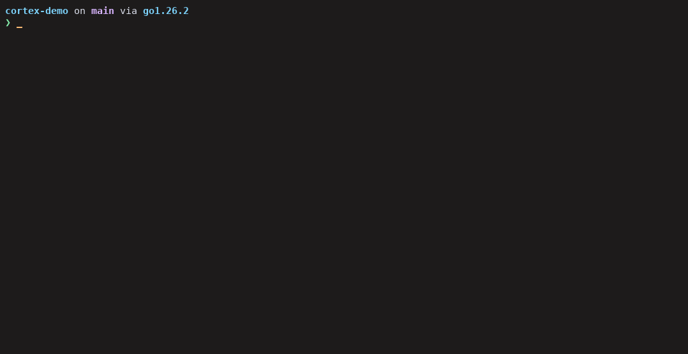
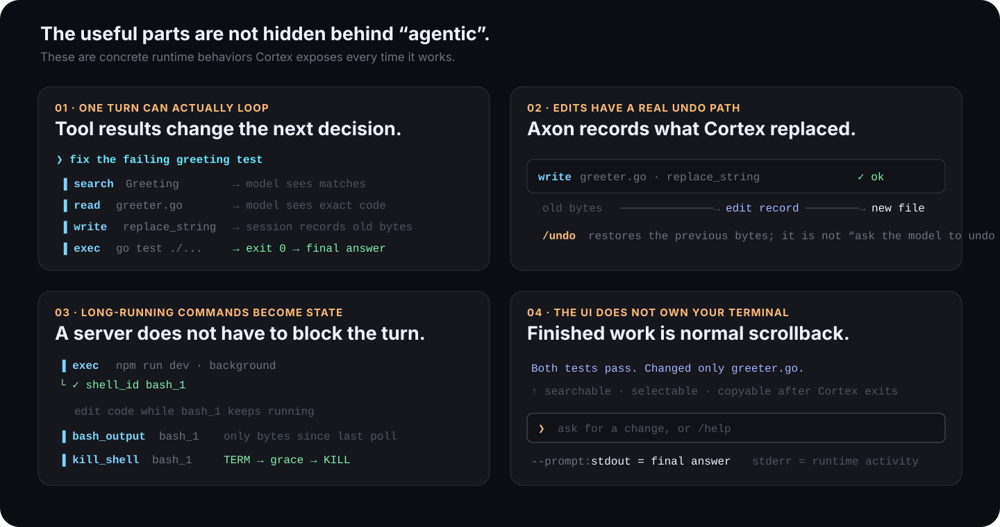

<div align="center">

# cortex

### Terminal coding agent. Real filesystem. Real shell. One loop until the change is verified.

Built in Go · powered by [Axon](https://github.com/atakang7/axon)

[](https://github.com/atakang7/cortex/releases/latest)
[](https://go.dev/)
[](https://github.com/atakang7/axon)
[](LICENSE)

**Search → read → edit → verify → stop.**

[Quickstart](https://atakang7.github.io/cortex/) · [Releases](https://github.com/atakang7/cortex/releases/latest) · [Axon runtime](https://github.com/atakang7/axon)

</div>

<p align="center">
  
</p>

<p align="center"><sub><b>This is the real Cortex binary running.</b> The model endpoint is deterministic so the recording is reproducible; the Bubble Tea UI, Axon turn loop, repository search, file read, atomic write, and <code>go test ./...</code> execution are real.</sub></p>

Cortex is a coding agent for repository work, not a chat box that happens to have a shell. A single turn can inspect the code, make an edit, run the command that tests the edit, feed that evidence back to the model, and continue until there is nothing left to do.

```sh
go install github.com/atakang7/cortex/cmd/cortex@latest
cd your-repository
cortex
```

**Setup is intentionally kept out of this README.** The [Lightning Quickstart](https://atakang7.github.io/cortex/) gets from zero to a running model in a few commands.

---

## What Cortex actually gets right

<p align="center">
  
</p>

### A tool call is not the end of the turn

The model does not issue one shell command and disappear. Axon returns each tool result to the model and keeps the same turn alive:

```text
request
  ↓
model → search → result
  ↑                 ↓
  └──── model ←─────┘
          ↓
        read → result
          ↓
        write → result
          ↓
        test → result
          ↓
      final answer
```

That distinction matters. “Fix the test” can naturally mean several searches, reads, edits, and test runs without inventing a new conversation turn for each step.

### `/undo` is not another prompt

Every Axon-managed write records the bytes it replaced. Writes are atomic, and `/undo` restores the previous bytes directly.

```text
write greeter.go
      ↓
record previous bytes
      ↓
atomic tmp + rename
      ↓
/undo → restore previous bytes
```

No model call is needed to remember what it changed.

### A dev server is runtime state, not a stuck command

Anything that may wait can run in the background. Cortex gets a `shell_id`, reads only output produced since the previous poll, and terminates the whole process group when it is done.

```text
exec(background=true) → bash_1
                         ↓
                  edit while alive
                         ↓
                  bash_output(bash_1)
                         ↓
                  kill_shell(bash_1)
```

This is the difference between “the agent can run shell commands” and an agent that can actually work around servers, watchers, clients, and other long-lived processes.

### The transcript belongs to your terminal

Cortex does not keep the completed conversation inside a giant alternate-screen application. Finished blocks are committed to normal terminal scrollback. They remain searchable, selectable, copyable, and visible after Cortex exits.

Only the part that is still changing is redrawn: active tool cards, streaming text, reasoning, the input box, and the status line.

### `--prompt` is not a second, weaker agent

Interactive mode and one-shot mode construct the same Axon agent. The only difference is presentation.

```sh
cortex --prompt "explain the public API changes since HEAD~5"
```

```text
stdout  → final assistant answer
stderr  → tool activity, notices, errors, trace path
```

So Cortex can be used in a terminal, a shell script, CI, or a benchmark harness without maintaining another execution path.

---

## The default loop is deliberately boring

Cortex's built-in coding prompt is opinionated in exactly the places that usually waste agent turns:

```text
search before guessing
        ↓
read before writing
        ↓
make the smallest change that solves the request
        ↓
run the command that proves the change
        ↓
if it failed, use the evidence and continue
        ↓
stop when the requested result is true
```

It explicitly tells the model not to spend a turn announcing work, not to rewrite a file to change three lines, not to refactor adjacent code, and not to call something finished when verification failed.

That behavior lives in [`internal/config/prompt.go`](internal/config/prompt.go). You can replace the prompt completely when you want a reviewer, migration agent, or another repository-specialized role.

---

## Small product, serious runtime

Cortex stays small because it does not reimplement the agent machinery inside the terminal UI.

```text
CORTEX
coding prompt · model/pruner choice · Bubble Tea UI · slash commands · config
                                  │
                                  │ axon.New(...)
                                  ▼
AXON
turn loop · tools · sessions · context · streaming · retries · background shells · MCP
                                  │
                                  ▼
repository · shell · model providers · MCP servers
```

The seam in Cortex is literally one constructor:

```go
return axon.New(axon.Config{
    Model:        model,
    SystemPrompt: cfg.SystemPrompt,
    MCPServers:   servers,
    OnEvent:      onEvent,
    Settings:     settings,
    Pruner:       prunerModel,
})
```

That separation is useful in practice: Cortex can stay focused on coding behavior and terminal UX while Axon owns the ugly reusable parts — tool continuation, session state, context projection, SSE streaming, retries, process lifecycle, and event delivery.

---

## The controls that matter

```text
/model          switch the active model without restarting the session
/pruner         switch or disable the secondary context model
/undo           restore the last Axon-managed file edit byte-for-byte
/session        show turn, message, edit, and session-file state
/cd <path>      move the agent to another working directory
/new            clear the session
/help           show the rest
```

The status line keeps the important state visible: active model, pruner, working directory, turn, elapsed time while busy, and the key that matters next.

For long sessions, the optional pruner changes only the context **projection** sent to the main model. The durable session history is not rewritten or deleted.

---

## Run it

```sh
go install github.com/atakang7/cortex/cmd/cortex@latest
```

Prebuilt Linux and macOS binaries for amd64/arm64 are published on [GitHub Releases](https://github.com/atakang7/cortex/releases/latest).

Then use the **[Lightning Quickstart](https://atakang7.github.io/cortex/)**. It covers the only setup you need immediately: provider, model, optional pruner, and `cortex`.

```sh
cortex
```

Or make the same agent one-shot:

```sh
cortex --prompt "find the regression introduced in the last five commits"
```

---

<div align="center">

Built with [Axon](https://github.com/atakang7/axon) · MIT

</div>
